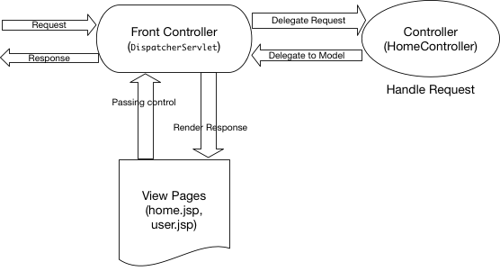

## Spring MVC

- #### A Spring MVC is a Java framework which is used to build web applications.
- #### It is build on top of Servlet.
- #### It follows the Model View Controller design pattern.
- #### It implements all the basic features of a core spring framework like inversion of control, dependency injection.
- #### It work around DispatcherServlet
- #### DispatcherServlet handles all the Http requests and responds. It dispatches the requests to handlers.
- ### Why Spring MVC?
    - Separate each role model,view,controller
    - Powerful configuration
    - Rapid Application Development.
    - Spring MVC is flexible, easy to test and much features.
    - Organise the code in our application.
- 

## Sending data from Controller to View

### Model

1. Create a `Model` object inside the **Controller**
   ([Controller](src/main/java/com/springwebmvc/controller/HomeController.java))
    ```java 
   
       @RequestMapping("/home")
        public String  home(Model model) {
            model.addAttribute("name", "subham");
            model.addAttribute("roll", 23);
            return "home";
        }
2. fetch data from request object and show in view([jsp page](src/main/webapp/WEB-INF/views/home.jsp))
   ```java
    
    <% String name = (String) request.getAttribute(key); %>
    <%=name%>

### ModelAndView

1. Create a `ModelAndView` object inside the **Controller**  
   ([Controller](src/main/java/com/springwebmvc/controller/HomeController.java))
   ```java 
   
    @GetMapping("/login")
    public ModelAndView login() {
          ModelAndView modelAndView = new ModelAndView();
          modelAndView.addObject("className","12th class");
          modelAndView.setViewName("login");
          reurn modelAndView;
      }

2. fetch data from request object and show in view (by Expression
   language)([jsp page](src/main/webapp/WEB-INF/views/login.jsp))
   ```java
   
    <p>Name: ${name}</p>
    <p>Age: ${age}</p>
## Sending data from View to Controller
1. ### @ModelAttribute
   we get the data after binding together
2. ### @RequestParam
    we can get the particular data
    ```java
    @PostMapping("/createuser")
    public String registerUser(@ModelAttribute User user,@RequestParam("name") String fname) {
    System.out.println(user);
    System.out.println(fname);
    return "register";
    }